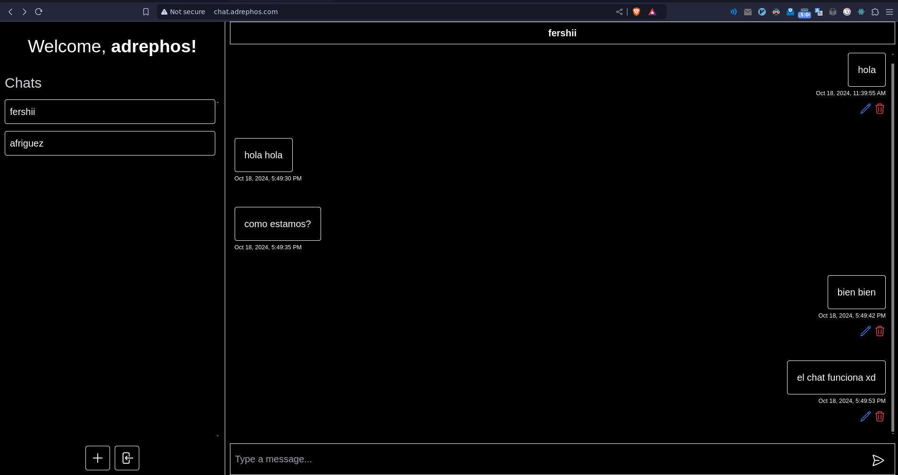
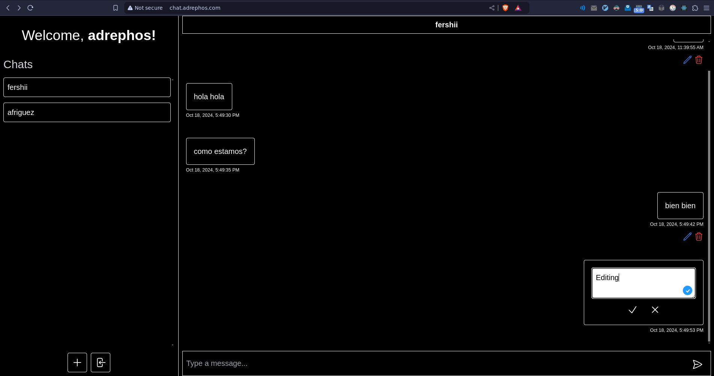
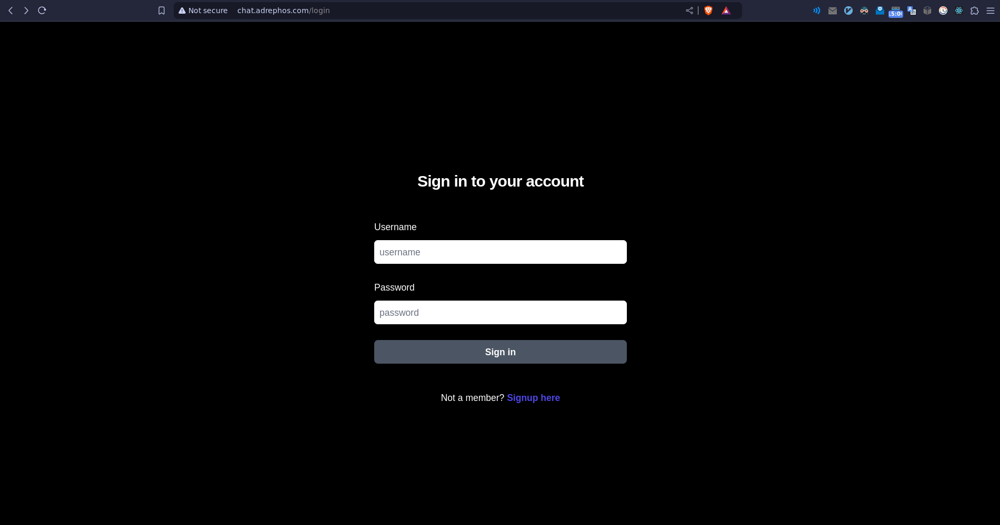
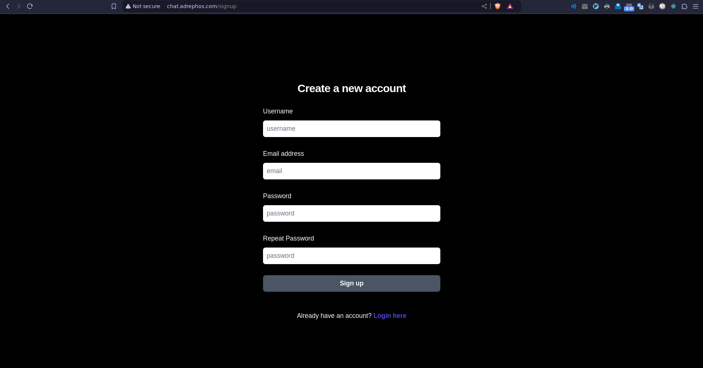

# Spring chat

A real-time chat application using Spring Boot, WebSockets, and Next.js.

## Getting started
To see backend and frontend instructions, please refer to the respective README files in the `backend` and `frontend` directories.
- [Backend README](backend/README.md)
- [Frontend README](frontend/README.md)

## Features
- Real-time messaging
- User authentication
- Message editing
- Message deletion
- In app notifications

## Screenshots
|  |  |
| --- | --- |
| Chat | Editing |
|  |  |
| Login | Sign up |
|  |  |

